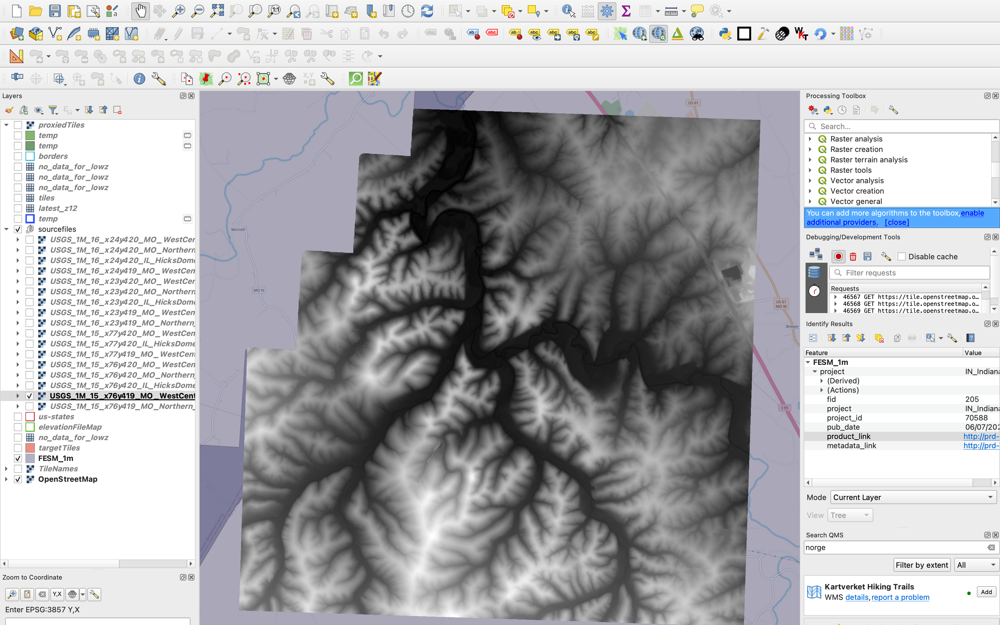

# DEM (Digital Elevation Model) showcase

Slovakia highest point:

From: https://www.freemap.sk/~martin/hikingmap/#style=hiking&lat=49.16471490&lng=20.13454914&zoom=14.25&bearing=-166.45&pitch=53.57&3d=true.

Madrid airport, terrain exaggeration, with low res Mapbox DEM:

High res DEM:

Nice Norwegian fjord in 3D:

Colored by absolute slope:

QGIS version:

Potential screenshot: 3D in QGIS?

# Processing description and screenshots

Start with: FESM_1m.gpkg.
https://prd-tnm.s3.amazonaws.com/index.html?prefix=StagedProducts/Elevation/1m/FullExtentSpatialMetadata/

US is divided up to many areas, we are given the URL for each area:

For each area, we have lots of TIFFs:

Many of them are oddly shaped:

Some aren't:

We want to create images files from elevation covering the area of specific XYZ tiles. Such as:

Note that there are TIFF sides parallel with canvas sides:

It's because project CRS is now set to the CRS of the TIFF. In exchange, webmercator tile grid is tilted.

Tile boundary visualisation is available openly: https://tilevis.fly.dev/XYZ/{z}/{x}/{y}. Visualisation of borders of single tiles: [merqantile plugin](https://plugins.qgis.org/plugins/merqantile/).
