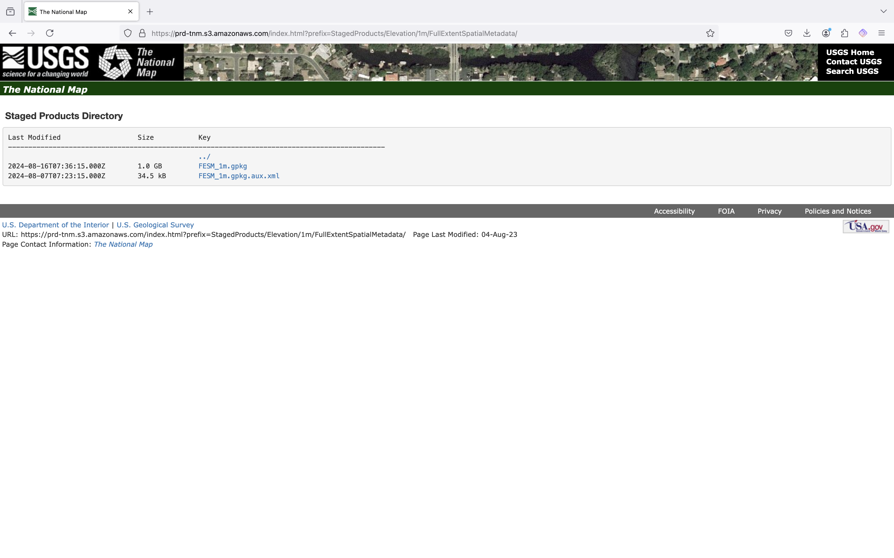
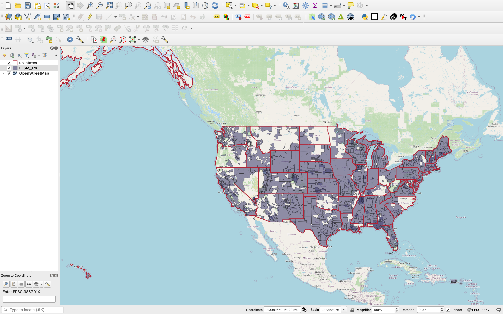

% Large scale DEM tiling for QGIS workflows
% Name Name
% QGIS UC 2024 Bratislava
---
width: 1600
height: 900
---

# About me

. . .

bla appearing first

. . .

bla appearing second

. . .

bla appearing third

* and some 
* bullet points

# Elevation data

## DEM

## DSM

## GeoTIFFs, COGs, .ascs

# GeoTIFFs in practice

## Huge

## Naming

is less conventional than that of XYZ tiles

# Tiling

. . .

* Built in QGIS support (XYZ layer)

. . .

* XYZ tiling: based on EPSG:3857

. . .

* Other tilings exists, we use XYZ

. . .

Let's dive into tiling.

# The plan

. . .

Area served: some US states

. . . 

Data source: USGS

. . .

File processing on AWS Batch

. . .

Serve result to QGIS from s3

# USGS

::: notes
Overview of what is available: https://apps.nationalmap.gov/downloader/
GPKG for file -> area mapping: https://prd-tnm.s3.amazonaws.com/index.html?prefix=StagedProducts/Elevation/1m/FullExtentSpatialMetadata/
:::

## 

##

# File processing overview

## High zoom tiling

::: notes
Choose base zoom level, max zoom level.
Create function which downloads those and only those source files which are within base zoom tile.
Tile from basezoom to maxzoom.
:::

## Low zoom tiling

## Optional: buffering

# AWS Batch infrastructure overview

## Job definitions

## Job queues

## Compute environments

## Jobs

# 